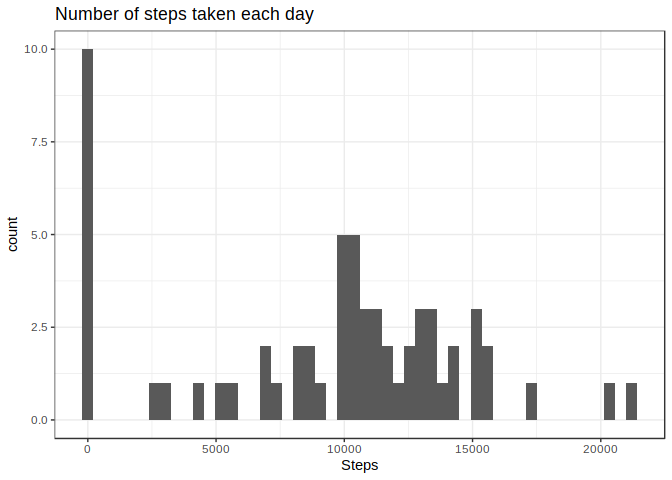
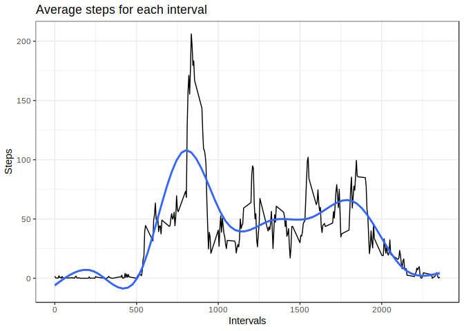
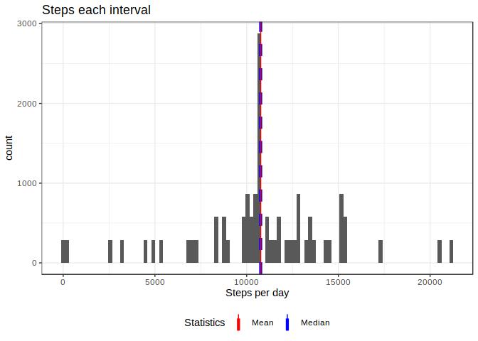
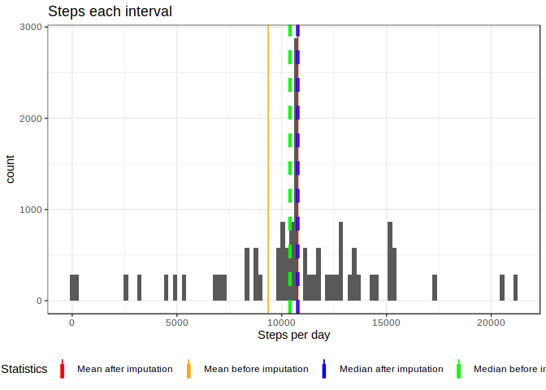
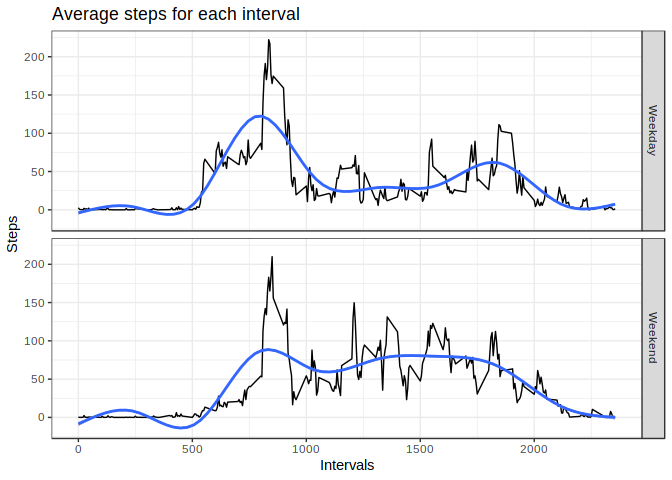

The variables included in this dataset are:

steps: Number of steps taking in a 5-minute interval (missing values are coded as NA)
date: The date on which the measurement was taken in YYYY-MM-DD format
interval: Identifier for the 5-minute interval in which measurement was taken

The dataset is stored in a comma-separated-value (CSV) file and there are a total of 17,568 observations in this dataset.

I will use the library data.table since I got use to it and is able to handle big data sets very efficiently


```r
library (data.table)
library (ggplot2)
```

## Loading and preprocessing the data

1. Code for reading in the dataset and/or processing the data

Unzip zip file and read it as csv

```r
unzip ("activity.zip")
activity <- fread ("activity.csv")
```


Check the new data frame created to get a sense of the data

```r
head (activity)
```

```
##    steps       date interval
## 1:    NA 2012-10-01        0
## 2:    NA 2012-10-01        5
## 3:    NA 2012-10-01       10
## 4:    NA 2012-10-01       15
## 5:    NA 2012-10-01       20
## 6:    NA 2012-10-01       25
```

```r
summary (activity)
```

```
##      steps            date              interval     
##  Min.   :  0.00   Length:17568       Min.   :   0.0  
##  1st Qu.:  0.00   Class :character   1st Qu.: 588.8  
##  Median :  0.00   Mode  :character   Median :1177.5  
##  Mean   : 37.38                      Mean   :1177.5  
##  3rd Qu.: 12.00                      3rd Qu.:1766.2  
##  Max.   :806.00                      Max.   :2355.0  
##  NA's   :2304
```


Transform each variable to a more suitable format

```r
activity$steps  <- as.numeric (activity$steps)
activity$date   <- as.Date (activity$date)
#activity$interval  <- as.factor (activity$interval)
```

## What is mean total number of steps taken per day?

```r
stepsDay <- activity [, .(totalStepsDay = sum (steps, na.rm = T)), by = date]
ggplot (stepsDay, aes (totalStepsDay)) +
    geom_histogram(bins = 50)+
    theme_bw ()+
    labs (title ="Number of steps taken each day",
          x = "Steps")
```

<!-- -->


## What is the average daily activity pattern?

I calculate the average of steps for each interval and I report the interval with the maximum value.

```r
activity [, meanStepsInterval := mean (steps, na.rm = T), by = as.factor (interval)]

ggplot (activity, aes (x = interval, y = meanStepsInterval))+
    geom_line () +
    geom_smooth (method = "auto") +
    theme_bw () +
    labs (title = "Average steps for each interval",
          x = "Intervals", y = "Steps")
```

```
## `geom_smooth()` using method = 'gam' and formula 'y ~ s(x, bs = "cs")'
```

<!-- -->

The 5-minute interval with more activity on average is 'r activity$interval [which.max (activity$stepsInterval)]`

## Imputing missing values
Impute NAs values from the "steps" variable with the mean of the number of steps taken for that interval along the entire data set

From the summary of the data set,

```r
summary (activity)
```

```
##      steps             date               interval      meanStepsInterval
##  Min.   :  0.00   Min.   :2012-10-01   Min.   :   0.0   Min.   :  0.000  
##  1st Qu.:  0.00   1st Qu.:2012-10-16   1st Qu.: 588.8   1st Qu.:  2.486  
##  Median :  0.00   Median :2012-10-31   Median :1177.5   Median : 34.113  
##  Mean   : 37.38   Mean   :2012-10-31   Mean   :1177.5   Mean   : 37.383  
##  3rd Qu.: 12.00   3rd Qu.:2012-11-15   3rd Qu.:1766.2   3rd Qu.: 52.835  
##  Max.   :806.00   Max.   :2012-11-30   Max.   :2355.0   Max.   :206.170  
##  NA's   :2304
```
we see only the "steps" variable holds 2304 cases with no value (NA).


Since I created before a new variable with the average number of steps for each interval ("meanStepsInterval"), I'll impute this value to the "step" variable if for any NA case


```r
activityFull <- activity
activityFull [is.na (activityFull$steps)]$steps <- activityFull [is.na (activityFull$steps)]$meanStepsInterval
```


Creating a plot showing the number of steps taken each day:

```r
activityFull [, sumStepsDay := sum (steps, na.rm = T), by = date]

ggplot (activityFull, aes (sumStepsDay)) +
    geom_histogram (bins = 100) +
    theme_bw () +
    geom_vline (aes (xintercept = median (activityFull$sumStepsDay, na.rm = T), color = "Median"), lty = 2, lwd = 1.5) +
    geom_vline (aes (xintercept = mean (activityFull$sumStepsDay, na.rm = T), color = "Mean"), lty = 1, lwd = 0.5) +
    labs (title = "Steps each interval",
          x = "Steps per day") +
    scale_color_manual (name = "Statistics", values = c (Median = "blue", Mean = "red")) +
    theme (legend.position = "bottom")
```

<!-- -->


We see that mots of the values after the imputation are distributed around a central value of around 11,000 steps per day. Actually, both median and mean have the same value (mean = 1.0766189\times 10^{4} and median = 1.0766189\times 10^{4}).

Before the imputation of the cases with no value (NAs) for the "steps" variable, the same meausres were different (mean = NA and median = ) than after the imputation, as we see represented on the graph.


```r
activity [, sumStepsDay := sum (steps, na.rm = T), by = date]

ggplot (activityFull, aes (sumStepsDay)) +
    geom_histogram (bins = 100) + 
    theme_bw () +
    geom_vline (aes (xintercept = median (activityFull$sumStepsDay, na.rm = T), color = "Median after imputation"), lty = 2, lwd = 1.5) +
    geom_vline (aes (xintercept = mean (activityFull$sumStepsDay, na.rm = T), color = "Mean after imputation"), lty = 1, lwd = 0.5) +
    geom_vline (aes (xintercept = median (activity$sumStepsDay, na.rm = T), color = "Median before imputation"), lty = 2, lwd = 1.5) +
    geom_vline (aes (xintercept = mean (activity$sumStepsDay, na.rm = T), color = "Mean before imputation"), lty = 1, lwd = 0.5) +
    labs (title = "Steps each interval",
          x = "Steps per day") +
    scale_color_manual (name = "Statistics", values = c ("Median after imputation" = "blue", "Mean after imputation" = "red", "Median before imputation" = "green",  "Mean before imputation" = "orange")) +
    theme (legend.position = "bottom")
```

<!-- -->

## Are there differences in activity patterns between weekdays and weekends?


```r
activityFull [, weekend := ifelse (  (format (activityFull$date, "%w") == "0") |
                                         (as.numeric (format (activityFull$date, "%w")) >= 5), 
                                     "Weekend", "Weekday")]

activityFull [, meanStepsIntervalWeek := mean (steps, na.rm = T), by = .(interval, weekend)]

ggplot (activityFull, aes (x = interval, y = meanStepsIntervalWeek))+
    geom_line () +
    geom_smooth (method = "auto") +
    theme_bw () +
    labs (title = "Average steps for each interval",
          x = "Intervals", y = "Steps") +
    facet_grid (weekend ~ .)
```

```
## `geom_smooth()` using method = 'gam' and formula 'y ~ s(x, bs = "cs")'
```

<!-- -->
